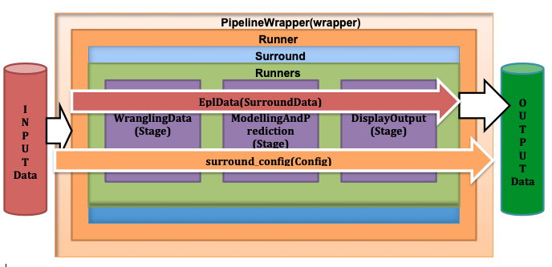

# epl

This example contains the data from the last 14 years(2006/07 to 2018/19) of the English Premire League. Data contains certain features and it is filtered further. Example epl contains SurroundData type object which has the prcoessed data in it. That data is splitted into train and test data which is then predicted using the Logistic Regression. The prediction result and it's analysis is then displayed and saved in the output directory.

Flow diagram of the example epl

# Run project

From the project's local folder:

`python3 __main__.p`
